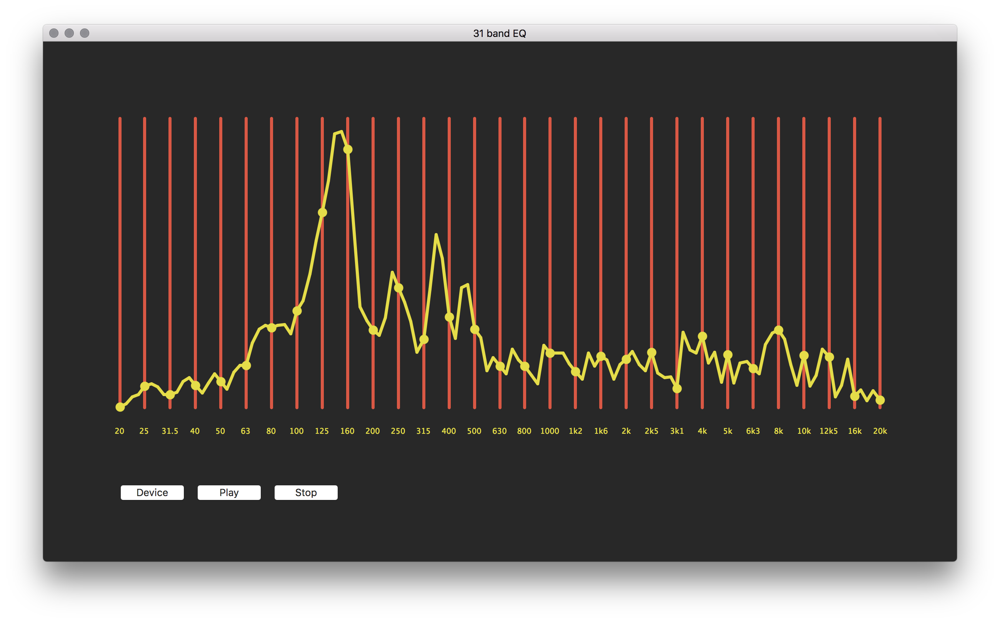

# frequencyAnalyzer

Graphical tool written in Python to measure frequency response of P.A. systems, in order to adjust the frequency range with a graphical EQ unit.

The frequencies that the EQ can adjust are defined in the `frequencies` variable, and a few intermediate frequencies should be measured between them (`intermediateSteps`).

Then, press `Play` to visualize the frequency response. 

This tool is a cheaply hacked implementation of similar professional solutions. It is meant to be used in combination with a professional sound card playing the frequencies to the P.A., and a professional measurement microphone to record them back into the computer. The system’s standard sound input and output devices are used.



Requires `pyaudio`, which in turns requires `portaudio`.

Install (on Mac):

```
brew install portaudio
pip install pyaudio
```